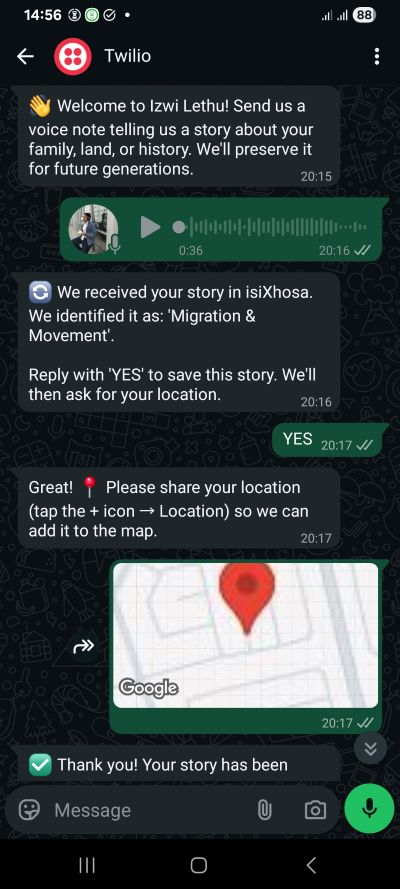
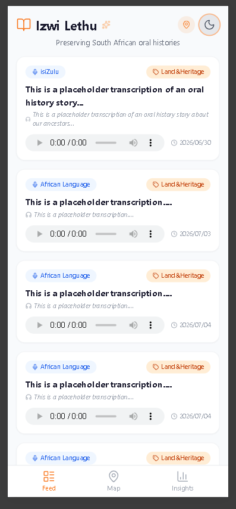
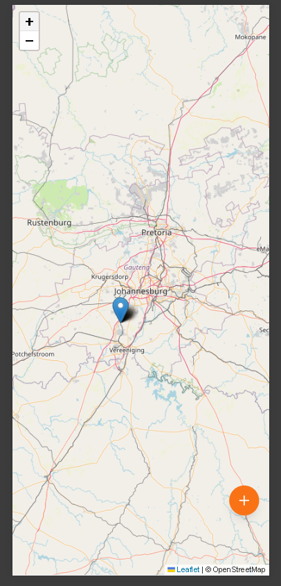
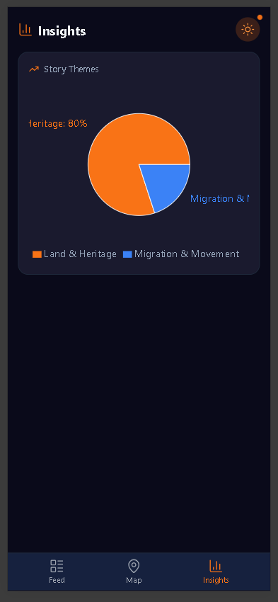
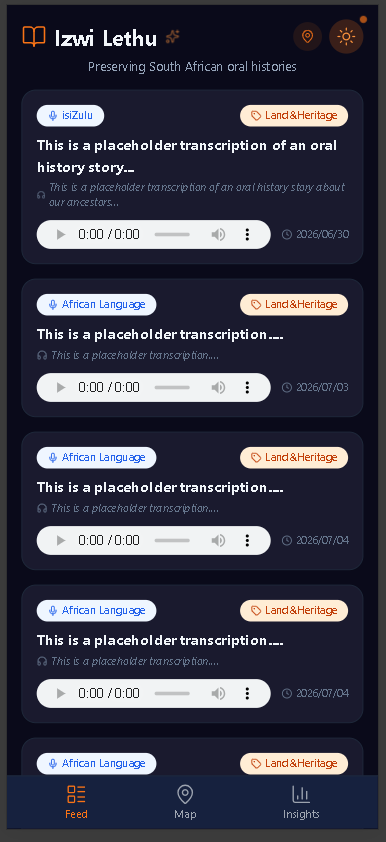

# 🗣️ Izwi Lethu - Reclaiming African Voices

### *Preserving South African Oral Histories Through AI & WhatsApp*

[](https://bit.ly/4dHevF5)
[](https://reactjs.org/)
[](https://flask.palletsprojects.com/)
[](https://elevenlabs.io/)
[](LICENSE)

---

## 📖 Overview

**Izwi Lethu** (isiZulu for *"Our Voice"*) is a mobile-first platform that preserves African oral histories using AI and WhatsApp. Elders record voice notes in their mother tongue, and the platform transcribes, translates, and automatically categorizes them into themes like *Migration*, *Land*, *Resistance*, *Family*, and *Culture*.

This project was built for the **Advancing African Digital Humanities Ideation Hub (AADHIH) Hackathon 2026**, with the mission to **reclaim African voices** through accessible, community-centered technology.

---

## 🎯 The Problem We're Solving

| Issue | Impact |
| :--- | :--- |
| **Oral histories are disappearing** | Every day, elders pass away taking centuries of knowledge with them |
| **Colonial archives exclude African voices** | Historical records are biased, incomplete, and lack African perspectives |
| **Digital tools are inaccessible** | High data costs, language barriers, and complex interfaces exclude communities |
| **Knowledge extraction, not empowerment** | Communities rarely own or benefit from their own stories |

---

## 💡 Our Solution

### ✨ Key Features

- **📱 WhatsApp Integration** – No app download required; works on any phone
- **🎙️ AI Transcription** – ElevenLabs Speech-to-Text converts voice notes to text
- **🌍 Translation** – Google Translate makes stories accessible in English
- **🧠 Smart Categorization** – TF-IDF + K-Means clustering automatically groups stories
- **🗺️ Interactive Map** – Visualize stories by location
- **📊 Analytics Dashboard** – See emerging themes at a glance
- **🌙 Dark Mode** – African neon orange accents with a modern dark theme
- **📍 Location Picker** – Users select exact story locations on a map
- **🔒 POPIA Compliant** – Explicit consent required before saving any story

---

## 🏗️ Tech Stack

### Frontend
| Technology | Purpose |
| :--- | :--- |
| **React 18** | UI framework |
| **Vite** | Build tool |
| **Tailwind CSS** | Styling |
| **React Router** | Navigation |
| **React-Leaflet** | Interactive maps |
| **Recharts** | Analytics charts |
| **Lucide React** | Icons |

### Backend
| Technology | Purpose |
| :--- | :--- |
| **Flask** | API server |
| **SQLAlchemy** | ORM (SQLite/PostgreSQL) |
| **ElevenLabs API** | Speech-to-Text transcription |
| **Google Translate API** | Language translation |
| **Scikit-learn** | TF-IDF + K-Means clustering |
| **Twilio API** | WhatsApp messaging |

### Architecture Diagram
```
┌──────────────────────────────────────────────────────────────┐
│                         USER FLOW                            │
├──────────────────────────────────────────────────────────────┤
│                                                              │
│  📱 WhatsApp          🤖 Backend           💻 Dashboard    │
│                                                              │
│  ┌──────────┐         ┌─────────────┐      ┌─────────────┐   │
│  │Voice Note│ ──────► │ElevenLabs   │ ───► │  Feed View  │   │
│  └──────────┘         │Transcription│      └─────────────┘   │
│       │               └─────────────┘            │           │
│       │              ┌─────────────┐      ┌─────────────┐    │
│       │              │Google       │ ───► │  Map View   │    │
│       │              │Translate    │      └─────────────┘    │
│       │              └─────────────┘            │            │
│       │              ┌─────────────┐      ┌─────────────┐    │
│       └─────────────►│TF-IDF +     │ ───► │  Insights   │    │
│  Reply "YES"         │K-Means      │      │  View       │    │
│  to consent          └─────────────┘      └─────────────┘    │
│       │                                                      │
│       └──────────────────────────────────────────────────────┘
└──────────────────────────────────────────────────────────────┘
```

---

## 📸 Screenshots

### WhatsApp Flow


### Dashboard - Feed View


### Dashboard - Map View


### Dashboard - Insights View


### Dark Mode



---

## 🚀 Getting Started

### Prerequisites

- **Python 3.10+**
- **Node.js 18+**
- **Twilio Account** (WhatsApp Sandbox)
- **ElevenLabs API Key** (free tier)
- **Google Translate API Key** (free tier)
- **ngrok** (for local testing)

---

### Installation

#### 1. Clone the Repository
```bash
git clone https://github.com/dondolo2/izwi-lethu.git
cd izwi-lethu
```

#### 2. Set Up Backend
```bash
cd backend

# Create virtual environment
python -m venv venv
source venv/bin/activate  # On Windows: venv\Scripts\activate

# Install dependencies
pip install -r requirements.txt

# Create .env file with your API keys
cp .env.example .env
# Edit .env with your actual keys
```

#### 3. Set Up Frontend
```bash
cd frontend

# Install dependencies
npm install

# Start development server
npm run dev
```

#### 4. Configure ngrok (for WhatsApp)
```bash
# In a separate terminal
ngrok http 5000

# Copy the ngrok URL (e.g., https://abc123.ngrok-free.app)
# Paste it into Twilio Sandbox settings: https://abc123.ngrok-free.app/webhook
```

#### 5. Run the Application
```bash
# Terminal 1: Backend
cd backend
python app.py

# Terminal 2: Frontend
cd frontend
npm run dev

# Terminal 3: ngrok
ngrok http 5000
```

---

### Environment Variables

Create a `.env` file in the `backend` folder:

```env
# Required
OPENAI_API_KEY=sk-...                       # Optional (if using OpenAI)
ELEVENLABS_API_KEY=your_elevenlabs_key     # Required for transcription
TWILIO_ACCOUNT_SID=AC...                   # Required for WhatsApp
TWILIO_AUTH_TOKEN=your_twilio_auth_token   # Required for WhatsApp
TWILIO_WHATSAPP_NUMBER=whatsapp:+123456789

# Optional (for fallback)
HUGGINGFACE_TOKEN=hf_...                    # Free alternative
GOOGLE_API_KEY=your_google_api_key          # For Google Translate
DEEPGRAM_API_KEY=your_deepgram_key          # Alternative STT
```

---

## 📱 How It Works

### The Full User Journey

1. **User sends a voice note** via WhatsApp to the Twilio Sandbox number

2. **Backend processes the audio:**
   - Downloads the audio from Twilio
   - Transcribes using ElevenLabs Speech-to-Text
   - Translates to English using Google Translate
   - Categorizes using TF-IDF + K-Means clustering
   - Saves pending story (waiting for consent)

3. **WhatsApp consent flow:**
   - Bot replies: *"We identified this as: 'Migration'. Reply 'YES' to save."*
   - User replies "YES"
   - Bot asks for location: *"Please share your location"*
   - User shares their location
   - Story is permanently saved with coordinates

4. **Story appears on the dashboard:**
   - Feed: Displayed as a card with playable audio
   - Map: Pin appears at the user's location
   - Insights: Cluster chart updates with new theme

---

## 🗺️ API Endpoints

| Endpoint | Method | Purpose |
| :--- | :--- | :--- |
| `/webhook` | POST | Twilio webhook for WhatsApp |
| `/api/stories` | GET | Fetch all saved stories |
| `/api/clusters` | GET | Fetch cluster statistics |
| `/api/audio/<id>` | GET | Serve audio file |

---

## 🧪 Testing

### Send a Test Voice Note

1. Open WhatsApp and scan the Twilio Sandbox QR code
2. Send a voice note to the Twilio number
3. Reply "YES" when prompted
4. Share your location
5. Open `http://localhost:3000` to see your story

### Run Tests (Coming Soon)
```bash
# Backend tests
cd backend
python -m pytest

# Frontend tests
cd frontend
npm test
```

---

## 📊 Judging Criteria Alignment

| Criterion | How Izwi Lethu Delivers |
| :--- | :--- |
| **Humanities Depth (30%)** | Preserves African oral histories, languages, and knowledge systems |
| **Community Impact (25%)** | WhatsApp accessibility for rural communities, consent-based ownership |
| **Accessibility (20%)** | No app download, low data usage, multi-language support |
| **Innovation (15%)** | AI transcription + TF-IDF/K-Means clustering on WhatsApp |
| **Sustainability (10%)** | Open-source, scalable, community-owned |

---

## 🌟 Future Enhancements

- [ ] **Real-time translation** using ElevenLabs Dubbing API
- [ ] **Multiple language support** for the dashboard
- [ ] **Story sharing** via social media
- [ ] **Collaborative archives** for community storytelling
- [ ] **Educational curriculum integration**
- [ ] **Advanced audio analytics** (sentiment, emotion detection)
- [ ] **Mobile native app** (React Native)

---

## 👥 Contributors

- **Musa Dondolo** – Developer, Designer, Researcher

---

## 📄 License

This project is licensed under the **MIT License** – see the [LICENSE](LICENSE) file for details.

---

## 🙏 Acknowledgments

- **AADHIH Hackathon** – For the opportunity and vision
- **ElevenLabs** – For the amazing Speech-to-Text API
- **Twilio** – For WhatsApp Business API
- **Google Translate** – For making stories accessible
- **UNISA** – For hosting and supporting African digital humanities

---

## 🔗 Links

- **Project Repository**: [https://github.com/dondolo2/izwi-lethu](https://github.com/yourusername/izwi-lethu)
- **Live Demo**: [https://your-demo-url.com](https://your-demo-url.com) *(coming soon)*

---

> *"When an elder dies, a library burns to the ground."* – African Proverb

**Izwi Lethu** is building a digital library that will never burn. 🌍🔥

---

## 📝 Submission Notes

**Hackathon:** AADHIH - Reclaiming African Voices  
**Team Size:** Individual  
**Submission Date:** 9 July 2026  
**Category:** Digital Humanities Innovation
